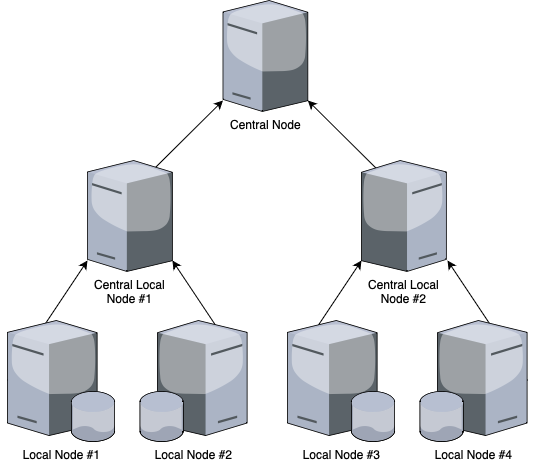

# Smart-Grid-IDS

The emergence of 5G and the Internet of Things has prompted nations across the globe to develop Smart Grids, an advanced electrical grid infrastructure capable of producing and transporting energy in a more reliable, sustainable, and efficient way. In addition, IoT devices, called smart meters, allow monitoring in real-time the energy production, consumption, and distribution. This large amount of data produced by the Smart Grid enables intelligent energy flow management to end-point consumers. With the nature of renewable energy sources such as solar and wind, this management is crucial to balance electricity supply and demand efficiently, avoiding energy loss. However, Smart Grids face several challenges, such as costs for upgrading current infrastructures, interoperability with the traditional energy grids, or privacy and cybersecurity risks due to the large number of distributed devices providing data to the grid.
Focusing on cybersecurity risks and, more specifically, anomaly detection. The proposed solution enables us to detect real-time cyberattacks in the Smart Grid through the network traffic between devices. Anomaly detection is performed through Time-Series Classifiers and by attending to real and frequent problems, such as data imbalance and causality, using real-world network traffic datasets. To turn our simulated context more realistic, we decided to simulate a Smart Grid with a Federated Learning environment through the *Flower* framework. Similar to a conventional Smart Grid, the system comprises several distributed nodes communicating between them.

## Configuration

### Nodes configuration

The configuration is made on [´./data/nodes.conf´](./data/nodes.conf) file. The base configurations is defined as the following example:

### Dataset

The dataset used is the [IEC61850-Security](./data/iec61850_security_dataset/) dataset.

## Running

To run the project, you need to run the following scripts regarding the number of nodes defined in the [´./data/nodes.conf´](./data/nodes.conf) file:

- Central Node: [´./src/central_node.py´](./src/central_node.py)
    - Set these enviroment variable as defined in [´./data/nodes.conf´](./data/nodes.conf):
        - "NODE_NAME"
        - "NODE_IP"
        - "NODE_PORT"

- Central Local Node: [´./src/central_local_node.py´](./src/central_local_node.py)
    - Set these enviroment variable as defined in [´./data/nodes.conf´](./data/nodes.conf):
        - "NODE_NAME"
        - "NODE_IP"
        - "NODE_PORT"
        - "SERVER_IP"
        - "SERVER_PORT"

- Local Node: [´./src/local_node.py´](./src/local_node.py)
    - Set these enviroment variable as defined in [´./data/nodes.conf´](./data/nodes.conf):
        - "NODE_NAME"
        - "SERVER_IP"
        - "SERVER_PORT"

The nodes will wait from the MQTT broker to send the status "running" to start the FL process.
For that it will necessary to run the GUI:

- GUI: [´./src/gui.py´](./src/gui.py)

And then, click on the "Start" button.

To feed the local nodes with data, run the following script:

- Data Generator: [´./src/data_generator.py´](./src/data_generator.py)
